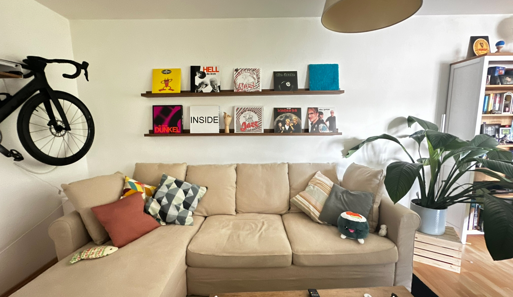

# VinylWallConfig

VinylWallConfig is a project that allows you to create a decorative vinyl wall display that connects to Spotify, enabling you to play your favorite albums by simply pressing wireless buttons associated with each vinyl.



## Motivation

- **Decorative Element**: Many vinyl collectors own records they love but rarely play. This project transforms them into an interactive decorative element for your home.
- **No Physical Turntable Required**: Enjoy your vinyl collection visually while playing the music through Spotify.
- **Wireless & Self-Powered**: The system uses self-powered wireless switches, eliminating the need for wires or battery replacements.
- **Simple Interface**: Easily connect to Spotify and swap out vinyls in your virtual collection through a web interface.

## Current Implementation and Features

- **Spotify Integration**: Login with your Spotify account to access your music library.
- **Web Interface**: A modern, responsive web interface for configuring your vinyl wall.
- **Button Configuration**: Set up wireless buttons to trigger specific albums on your virtual shelf.
- **Multiple Shelf Layouts**: Store and switch between different shelf configurations.
- **Ready-to-Go Docker Setup**: Complete Docker Compose configuration for easy deployment.
- **Scalable**: Support for up to 30 vinyls with 2 receivers. Shelf layouts fully dynamical.


## Hardware Requirements

### Recommended Components

- **Raspberry Pi 5** (recommended for optimal performance)
- **IKEA MOSSLANDA Picture Ledge**: Provides the modular shelves for displaying your vinyl records
  - Available at: https://www.ikea.com/us/en/p/mosslanda-picture-ledge-walnut-effect-70586936/
- **Self-Powered Wireless Switches**: DFRobot Self-powered Wireless Switches
  - Available at: https://www.dfrobot.com/product-2568.html
- **Wireless Receiver**: DFRobot Wireless Receiver
  - Available at: https://www.dfrobot.com/product-2430.html

## Setup Instructions

### Hardware Setup

1. **Mount the IKEA MOSSLANDA shelves** on your wall where you want to display your vinyl records.
2. **Connect the wireless receiver** to your Raspberry Pi using the following GPIO pin configuration or configure your own.
   ```
   GPIO_CONFIGURATION='4, 5, 6, 7, 8, 9, 11, 12'
   ```
4. **Pair every wireless button to its receiver** (https://wiki.dfrobot.com/SKU_TEL0146_Self-Powered_Wireless_Switch_433Mhz#Pairing)
3. **Place your vinyl records** on the shelves.

### Software Setup

1. **Install Docker and Docker Compose** on your Raspberry Pi:
   ```bash
   curl -sSL https://get.docker.com | sh
   ```

2. **Clone the repository**:
   ```bash
   git clone https://github.com/P-Muench/VinylWallConfig.git
   cd VinylWallConfig
   ```

3. **Create SSL certificates** for secure communication:
   ```bash
   mkdir -p certs
   openssl req -x509 -newkey rsa:4096 -keyout certs/key.pem -out certs/cert.pem -days 3650 -nodes -subj "/CN=localhost"
   ```

4. **Configure environment variables**:
   - Copy the example .env file and modify as needed:
   ```bash
   cp .env.example .env
   ```
   
5. - Get your Spotify API credentials from https://developer.spotify.com/dashboard
   - Set https://raspberrypi.local/login (or however your RPi is reachable in your network) as redirect URI
   - Update the Spotify API credentials in the .env file:
     ```
     SPOTIPY_CLIENT_ID=your_spotify_client_id
     SPOTIPY_CLIENT_SECRET=your_spotify_client_secret
     SPOTIPY_REDIRECT_URI=https://raspberrypi.local/login
     ```

6. **Start the application**:
   ```bash
   sudo docker compose up -d
   ```

7. **Access the web interface**:
   - Open a browser and navigate to `https://your_raspberry_pi_ip/`
   - If you are using the self signed certificates generated before make sure to accept the insecure connection
   - Follow the on-screen instructions to log in to Spotify and configure your vinyl wall

## Usage

1. **Configure Your Shelf**:
   - Use the web interface to create a virtual representation of your vinyl shelf
   - Add, remove, and arrange shelf spots to match your physical shelf layout

2. **Add Albums**:
   - Search for albums in the Spotify library
   - Assign albums to specific spots on your virtual shelf

3. **Pair Wireless Buttons**:
   - Click on a shelf spot button in the interface
   - Press the physical wireless button you want to associate with that spot
   - The system will confirm the pairing with a visual indicator

4. **Play Music**:
   - Simply press the wireless button associated with a vinyl to start playing that album on Spotify
   - The music will play on your currently active Spotify device

5. **Manage Devices**:
   - Use the Devices page to select which Spotify device should play the music

## Troubleshooting

- **Button Not Responding**: Ensure the wireless receiver is properly connected to the correct GPIO pins
- **Spotify Connection Issues**: Verify your Spotify API credentials in the .env file
- **Web Interface Not Loading**: Check that all Docker containers are running with `docker-compose ps`

## Todos:
- only apply fixture if DB is empty
- better spotify login
- 